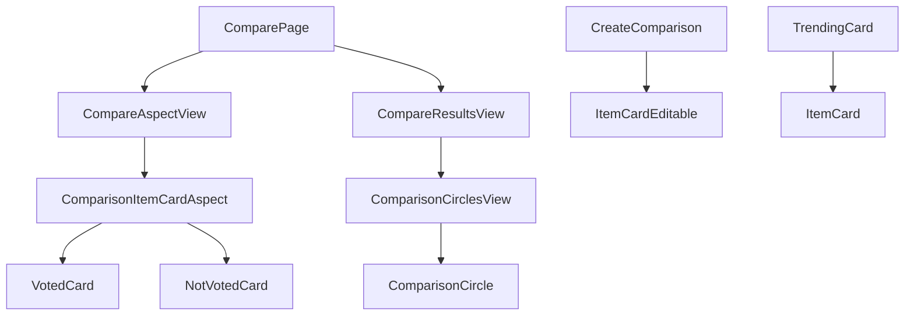

# UI Components Documentation

## Core Guidelines

### Data Fetching
- Components should NOT make direct API calls
- Use hooks (e.g., useQuery, useMutation) for data fetching
- Use services for API interactions
- Components should only handle UI rendering and user interactions

## Layout Structure

### Base Layout
- Main wrapper: `min-h-screen flex flex-col`
- Header: Fixed position, full width
- Main content: `flex-grow` with proper padding
- Footer: Fixed position, full width
- Safe area insets: Use CSS variables for mobile devices

### Spacing System
- Base unit: 4px (0.25rem)
- Common spacings: 4, 8, 16, 24, 32, 48, 64px
- Container padding: 16px (mobile), 24px (tablet), 32px (desktop)
- Section margins: 32px (mobile), 48px (tablet), 64px (desktop)

## Responsive Grid System

### Breakpoints
- Mobile: < 640px
- Tablet: 640px - 1024px
- Desktop: > 1024px

### Grid Layouts
- Mobile: Single column
- Tablet: Two columns
- Desktop: Three columns
- Use CSS Grid for complex layouts
- Use Flexbox for simple layouts

### Common Grid Patterns
- Item cards: 1 column (mobile), 2 columns (tablet), 3 columns (desktop)
- Comparison views: 1 column (mobile), 2 columns (tablet/desktop)
- Dashboard: 1 column (mobile), 2 columns (tablet), 3 columns (desktop)

## Theme Integration

### Color System
- Primary: Theme's primary color
- Secondary: Theme's secondary color
- Background: Theme's background color
- Text: Theme's text color
- Border: Theme's border color

### Component Colors
- Cards: Background (20% opacity of item color)
- Borders: Full opacity of item color
- Text: Darkened version of item color
- Hover states: 10% lighter than base color

### Theme Variables
- Use CSS variables for all theme colors
- Implement dark/light mode transitions
- Ensure proper contrast ratios
- Maintain consistent opacity levels

## Component Structure

### ItemCard (List View)
- Fixed height: 80px
- Image: 40x40px
- Text: 16px
- Tags: 12px
- Border: 1px
- Hover: Scale 1.02

### VotedCard (Grid View)
- Fixed aspect ratio: 1:1
- Image: Cover
- Text: 18px
- Border: 4px
- Hover: Scale 1.05

### NotVotedCard (Grid View)
- Fixed aspect ratio: 1:1
- Image: Cover
- Text: 18px
- Border: 4px
- Hover: Scale 1.05

### ItemCardEditable (Creation View)
- Fixed height: 120px
- Image upload: 80x80px
- Input fields: 16px
- Buttons: 40px height

## Animation Guidelines

### Transitions
- Card hover: 0.3s ease-in-out
- Page transitions: 0.3s ease-in-out
- Theme changes: 0.2s ease-in-out

### Effects
- Scale on hover: 1.02-1.05
- Shadow on hover
- Fade in/out
- Slide transitions

## Best Practices

### Image Handling
- Lazy loading
- Fallback to text
- Error states
- Aspect ratio maintenance

### Interaction States
- Hover effects
- Active states
- Loading states
- Error states
- Success states

## Component Relationships

